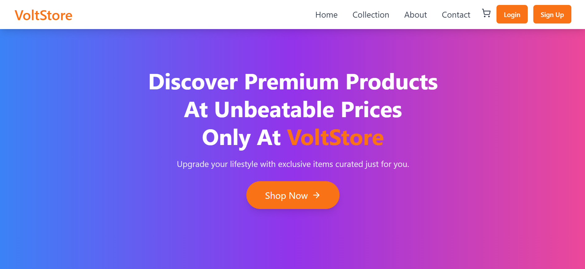
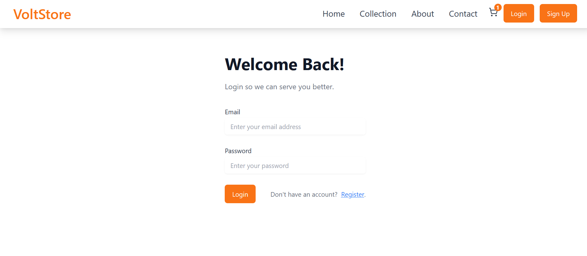
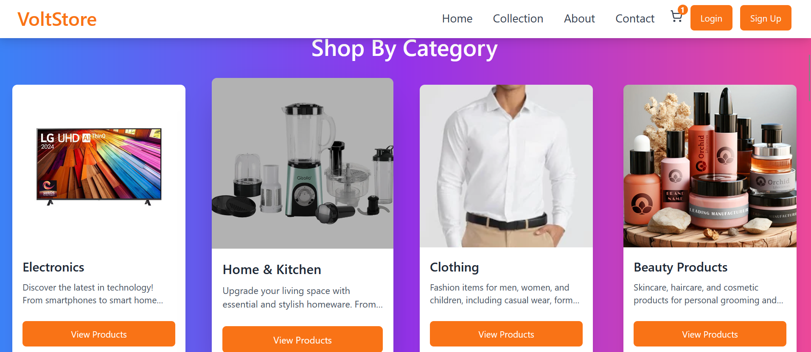
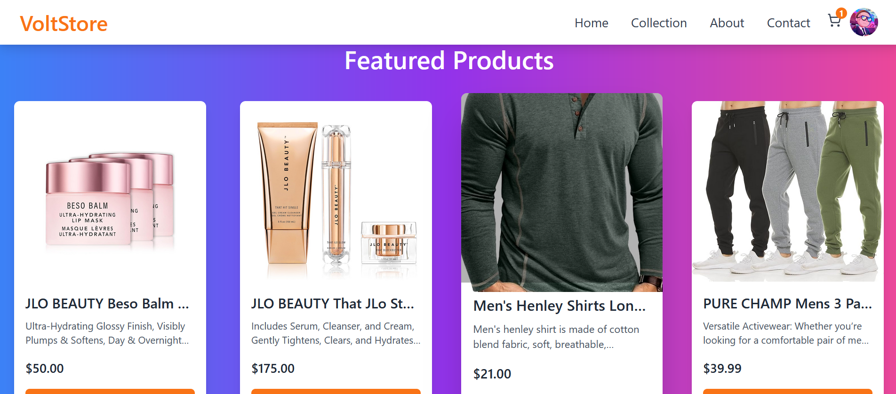
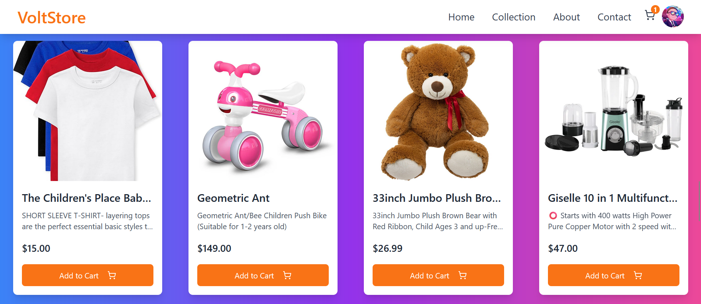
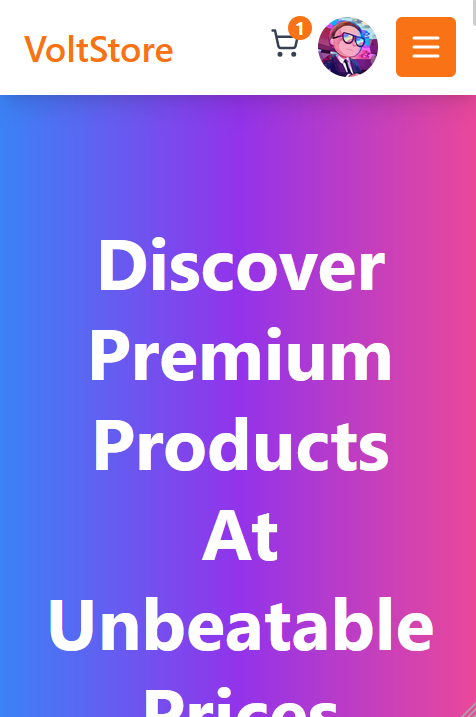
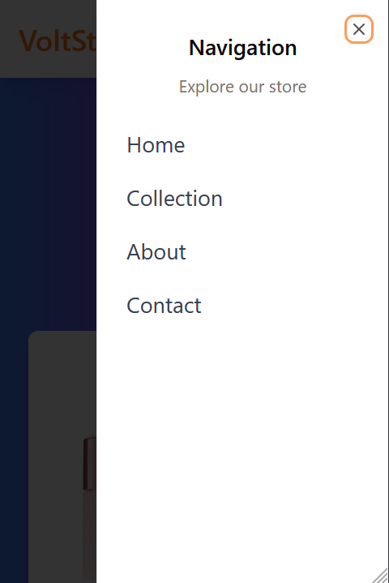

# Voltstore
An online Ecommerce Platform

## Screenshots









## Table of Contents
1. [Introduction](#introduction)
2. [Technology Stack](#technology-stack)
3. [Project Structure](#project-structure)
4. [Features](#features)
5. [Installation](#installation)
   - [Client Side](#client-side)
   - [Admin Side](#admin-side)
   - [Backend API](#backend-api)
6. [Usage](#usage)
   - [Client Side](#client-side-usage)
   - [Admin Side](#admin-side-usage)
   - [Backend API Usage](#backend-api-usage)
7. [API Documentation](#api-documentation)
8. [Routes and Controllers Overview](#routes-and-controllers-overview)
9. [Contributing](#contributing)
10. [Authors](#authors)
11. [License](#license)

## Introduction
Voltstore is an e-commerce website designed to provide consumers with a reliable online shopping environment with a wide range of products at low prices.

## Features

1. **User-Friendly Interface**: Intuitive navigation and a clean layout to enhance the shopping experience.
2. **Product Catalog**: Detailed product pages with high-quality images, descriptions, and specifications.
3. **Search Functionality**: Advanced search options with filters for categories, prices, sizes, and more.
4. **Shopping Cart**: Easy-to-use cart that allows users to add, edit, or remove items before checkout.
5. **Secure Checkout Process**: Streamlined, secure checkout with multiple payment options (credit/debit cards, PayPal, etc.).
6. **User Accounts**: Option for customers to create accounts to save their information, track orders, and manage preferences.
7. **Mobile Responsiveness**: Optimized for mobile devices to ensure a smooth experience on smartphones and tablets.
9. **Order Tracking**: Customers can track their orders through the website.
10. **Analytics and Reporting**: Tools to analyze user behavior, sales performance, and inventory status.
11. **SEO Optimization**: Built-in tools to improve search engine visibility and attract organic traffic.
12. **Advanced Filter Options**: Unique filtering options for enhancing the shopping experience by helping customers find exactly what they want.

---

## Technology Stack

### Frontend
- **Next.js** (TypeScript) - Server-rendered React framework for building optimized, scalable web applications.
- **React.js** (JavaScript) - Used for component-based UI development.
- **shadcn** - Utility-first component library for custom styling and components.
- **Material UI** - UI library providing pre-styled components to ensure a modern, responsive design.

### Backend
- **Node.js** - JavaScript runtime used for building fast and scalable server applications.
- **Express.js** - Web framework for Node.js to create RESTful APIs and manage server-side logic.
- **MongoDB** - NoSQL database for efficient, flexible data storage and retrieval.

### Authentication
- **JWT (JSON Web Token)** - Secure, stateless authentication method for handling user sessions.

---

## Project Structure
```markdown
.
├── README.md
├── admin
│   ├── package-lock.json
│   ├── package.json
│   ├── public
│   │   ├── _redirects
│   │   ├── favicon.ico
│   │   ├── index.html
│   │   ├── logo.png
│   │   ├── logo192.png
│   │   ├── logo512.png
│   │   ├── manifest.json
│   │   └── robots.txt
│   └── src
│       ├── App.css
│       ├── App.js
│       ├── App.test.js
│       ├── assets
│       │   └── images
│       │       └── doc.png
│       ├── components
│       │   ├── UnavalableDates
│       │   │   └── UnavalableDates.js
│       │   ├── appointments
│       │   │   ├── AppointmentDetail.js
│       │   │   ├── Appointments.js
│       │   │   ├── Dialog.js
│       │   │   └── TableData.js
│       │   ├── category
│       │   │   ├── AddCategory.js
│       │   │   ├── Category.js
│       │   │   └── CategoryData.js
│       │   ├── customers
│       │   │   ├── CustomerData.js
│       │   │   └── Customers.js
│       │   ├── dashboard
│       │   │   ├── Chart.js
│       │   │   ├── Dashboard.js
│       │   │   ├── Deposits.js
│       │   │   ├── Orders.js
│       │   │   ├── Title.js
│       │   │   └── listItems.js
│       │   ├── departments
│       │   │   └── Departments.js
│       │   ├── doctors
│       │   │   ├── AddDoctor.js
│       │   │   ├── DoctorDetails.js
│       │   │   ├── Doctors.js
│       │   │   ├── DoctorsData.js
│       │   │   └── DoctorsDialog.js
│       │   ├── login
│       │   │   ├── Login.js
│       │   │   └── login.css
│       │   ├── management
│       │   │   ├── AddAdmin.js
│       │   │   ├── Admins.js
│       │   │   ├── EditableDate.js
│       │   │   └── UnAvailableDates.js
│       │   ├── orders
│       │   │   ├── Orders.js
│       │   │   └── OrdersData.js
│       │   ├── pageNotFound
│       │   │   └── PageNotFound.js
│       │   ├── products
│       │   │   ├── AddProduct.js
│       │   │   ├── Products.js
│       │   │   └── ProductsData.js
│       │   └── transactions
│       │       ├── TransactionTable.js
│       │       └── Transactions.js
│       ├── global.css
│       ├── index.css
│       ├── index.js
│       ├── logo.svg
│       ├── reportWebVitals.js
│       ├── setupTests.js
│       ├── state
│       │   ├── adminSlice.js
│       │   ├── appointmentSlice.js
│       │   ├── categorySlice.js
│       │   ├── departmentSlice.js
│       │   ├── dialogSlice.js
│       │   ├── doctorSlice.js
│       │   ├── orderSlice.js
│       │   ├── productSlice.js
│       │   ├── store.js
│       │   ├── transactionSlice.js
│       │   ├── unAvailableDatesSlice.js
│       │   └── userSlice.js
│       ├── styles
│       │   └── navbar.css
│       └── utils
│           ├── ProtectedRoute.js
│           └── PublicRoute.js
├── backend
│   ├── README.md
│   ├── app.ts
│   ├── config
│   │   └── db.ts
│   ├── controllers
│   │   ├── adminController.ts
│   │   ├── cartController.ts
│   │   ├── categoryController.ts
│   │   ├── orderController.ts
│   │   ├── productController.ts
│   │   ├── transactionController.ts
│   │   └── userController.ts
│   ├── dist
│   │   ├── app.js
│   │   ├── config
│   │   │   └── db.js
│   │   ├── controllers
│   │   │   ├── adminController.js
│   │   │   ├── cartController.js
│   │   │   ├── categoryController.js
│   │   │   ├── orderController.js
│   │   │   ├── productController.js
│   │   │   └── userController.js
│   │   ├── middlewares
│   │   │   ├── authMiddleware.js
│   │   │   ├── authorize.js
│   │   │   ├── errorMiddleware.js
│   │   │   ├── file.js
│   │   │   ├── logger.js
│   │   │   └── validation.js
│   │   ├── models
│   │   │   ├── Product.js
│   │   │   ├── cart.js
│   │   │   ├── category.js
│   │   │   ├── order.js
│   │   │   ├── payment.js
│   │   │   ├── review.js
│   │   │   ├── types.js
│   │   │   └── user.js
│   │   ├── routes
│   │   │   ├── adminRoutes.js
│   │   │   ├── cartRoutes.js
│   │   │   ├── categoryRoutes.js
│   │   │   ├── orderRoutes.js
│   │   │   ├── productRoutes.js
│   │   │   └── userRoutes.js
│   │   └── services
│   │       └── upload.js
│   ├── express.d.ts
│   ├── middlewares
│   │   ├── authMiddleware.ts
│   │   ├── authorize.ts
│   │   ├── errorMiddleware.ts
│   │   ├── file.ts
│   │   ├── logger.ts
│   │   └── validation.ts
│   ├── models
│   │   ├── Product.ts
│   │   ├── cart.ts
│   │   ├── category.ts
│   │   ├── order.ts
│   │   ├── payment.ts
│   │   ├── review.ts
│   │   ├── types.ts
│   │   └── user.ts
│   ├── package-lock.json
│   ├── package.json
│   ├── routes
│   │   ├── adminRoutes.ts
│   │   ├── cartRoutes.ts
│   │   ├── categoryRoutes.ts
│   │   ├── orderRoutes.ts
│   │   ├── productRoutes.ts
│   │   ├── transactionRoute.ts
│   │   └── userRoutes.ts
│   ├── services
│   │   └── upload.ts
│   ├── tsconfig.json
│   ├── types
│   └── uploads
│       ├── categories
│       └── products
└── frontend
    ├── README.md
    ├── app
    │   ├── (auth)
    │   │   ├── login
    │   │   │   └── page.tsx
    │   │   └── register
    │   │       └── page.tsx
    │   ├── about
    │   │   └── page.tsx
    │   ├── cart
    │   │   └── page.tsx
    │   ├── checkout
    │   │   └── page.tsx
    │   ├── clientProvider.tsx
    │   ├── collection
    │   │   ├── [id]
    │   │   │   └── page.tsx
    │   │   └── page.tsx
    │   ├── contact
    │   │   └── page.tsx
    │   ├── favicon.ico
    │   ├── fonts
    │   │   ├── GeistMonoVF.woff
    │   │   └── GeistVF.woff
    │   ├── globals.css
    │   ├── layout.tsx
    │   ├── orders
    │   │   └── page.tsx
    │   └── page.tsx
    ├── components
    │   ├── Cart.tsx
    │   ├── CartContext.tsx
    │   ├── Footer.tsx
    │   ├── Header.tsx
    │   └── ui
    │       ├── avatar.tsx
    │       ├── button.tsx
    │       ├── card.tsx
    │       ├── dropdown-menu.tsx
    │       ├── input.tsx
    │       └── sheet.tsx
    ├── components.json
    ├── context
    │   └── AuthContext.tsx
    ├── lib
    │   ├── functions.ts
    │   ├── types.ts
    │   └── utils.ts
    ├── middleware.ts
    ├── next-env.d.ts
    ├── next.config.ts
    ├── package-lock.json
    ├── package.json
    ├── postcss.config.mjs
    ├── public
    │   └── logo.png
    ├── redux
    │   ├── slices
    │   │   ├── authSlice.ts
    │   │   ├── ordersApiSlice.ts
    │   │   ├── productsApiSlice.ts
    │   │   └── userApiSlice.ts
    │   └── store.ts
    ├── tailwind.config.ts
    ├── tsconfig.json
    └── types
        ├── orders.ts
        ├── products.ts
        └── user.ts

61 directories, 186 files
```

## Installation

### Client Side
1. Clone the repository:
   ```bash
   git clone https://github.com/IbnuJabir/Voltstore.git
   ```
2. Navigate to the client directory:
   ```bash
   cd frontend
   ```
3. Install dependencies:
   ```bash
   npm install
   ```
4. Start the client application:
   ```bash
   npm run dev
   ```

### Admin Side
1. Clone the repository:
   ```bash
   git clone https://github.com/IbnuJabir/Voltstore.git
   ```
2. Navigate to the admin directory:
   ```bash
   cd admin
   ```
3. Install dependencies:
   ```bash
   npm install
   ```
4. Start the admin application:
   ```bash
   npm start
   ```

### Backend API 
1. Navigate to the backend directory:
   ```bash
   cd backend
   ```
2. Install dependencies:
   ```bash
   npm install
   ```
3. Create a .env file with the necessary environment variables.
4. Start the server:
   ```bash
   npm run dev
   ```

## Usage

### Client Side Usage

1. **Browsing Products**  
   - Explore the available products by browsing through categories or viewing all items.
   - Each product includes details such as images, descriptions, price, and available stock.

2. **Product Categories**  
   - Filter products by categories to find specific types of items, making browsing easier and more personalized.

3. **Shopping Cart**  
   - Add items to the cart with a single click and adjust quantities as needed.
   - View cart summary to see the total price and make final adjustments before checkout.

4. **Checkout Process**  
   - Proceed to checkout after finalizing the cart.
   - Enter shipping information, select a payment method, and review the order before confirming.

5. **User Registration and Login**  
   - Create an account to save order history, track orders, and simplify future purchases.
   - Registered users can log in to access saved addresses, payment options, and track ongoing orders.

6. **Order Placement and Tracking**  
   - Place orders after checkout and receive a confirmation email with order details.
   - Track the status of placed orders through the "My Orders" section, showing updates from processing to delivery.

7. **Contact and About Pages**  
   - Visit the Contact page for customer support inquiries or feedback.
   - Learn about the company and its values on the About page for a deeper connection with the brand.

### Admin Side Usage
1. Accessing the Admin Panel
2. Navigating the Dashboard
3. Managing Products
4. Handling Orders
5. Customer Management
6. Configuring Settings
7. Analyzing Reports
8. Regular Maintenance

### Backend API Usage
1. **Base URL**
   ```
   https://api-voltstore.up.railway.app/
   ```

2. **Authentication**
   To interact with the API, you need to authenticate your requests using an API key. Include your API key in the request headers:
   ```http
   Authorization: Bearer YOUR_API_KEY
   ```

3. **Making Requests**
   You can use various tools or programming libraries to send HTTP requests. Common methods include:

   - **cURL**: Command-line tool for testing API calls.
   - **Postman**: A popular GUI tool for API development.
   - **Programming Libraries**: Such as `fetch` (JavaScript), `

requests` (Python), or `http.client` (Java).

   Using cURL:
   ```bash
   curl -X GET "https://api-voltstore.up.railway.app/" -H "Authorization: Bearer YOUR_API_KEY"
   ```

4. **HTTP Methods**
   - **GET**: Retrieve data.
   - **POST**: Create new data.
   - **PUT**: Update existing data.
   - **DELETE**: Remove data.

5. **Handling Responses**
   - **Success Responses**: Usually contain the requested data and a `200 OK` status code.
   - **Error Responses**: Provide error messages and relevant HTTP status codes (e.g., `400 Bad Request`, `404 Not Found`, `500 Internal Server Error`).

6. **Error Handling**
   - **400 Bad Request**: Check the request parameters.
   - **401 Unauthorized**: Verify your API key.
   - **404 Not Found**: The resource does not exist.
   - **500 Internal Server Error**: An issue occurred on the server side.

## API Documentation
**Base URL**
```
https://api-voltstore.up.railway.app/
```

**Authentication**
- **API Key**: Required for all requests. Include in the header as:
   ```http
   Authorization: Bearer YOUR_API_KEY
   ```

## Routes and Controllers Overview

For your e-commerce project, based on the **models** we defined (User, Product, Cart, Order), here’s a breakdown of the **routes and controllers** you’ll likely need.

### 1. **User Routes and Controller**
The **User model** manages user accounts (e.g., customers and admins). You’ll need routes for authentication and user profile management.

**Routes:**
- **POST** `/api/users/register` – Register a new user  
- **POST** `/api/users/login` – Authenticate user  
- **GET** `/api/users/profile` – Get logged-in user profile  
- **PUT** `/api/users/profile` – Update user profile  
- **DELETE** `/api/users/:id` – Delete a user (admin only)

**Controller Functions:**
- `registerUser`
- `loginUser`
- `getUserProfile`
- `updateUserProfile`
- `deleteUser`


### 2. **Product Routes and Controller**
The **Product model** will handle product data, like listings and categories.

**Routes:**
- **GET** `/api/products` – Get all products  
- **GET** `/api/products/:id` – Get a single product by ID  
- **POST** `/api/products` – Create a new product (admin only)  
- **PUT** `/api/products/:id` – Update a product (admin only)  
- **DELETE** `/api/products/:id` – Delete a product (admin only)

**Controller Functions:**
- `getAllProducts`
- `getProductById`
- `createProduct`
- `updateProduct`
- `deleteProduct`

### 3. **Cart Routes and Controller**
The **Cart model** manages the shopping cart, including adding/removing products and viewing the cart.

**Routes:**
- **GET** `/api/cart` – Get the user’s cart  
- **POST** `/api/cart` – Add an item to the cart  
- **PUT** `/api/cart` – Update item quantity in the cart  
- **DELETE** `/api/cart/:productId` – Remove an item from the cart  
- **DELETE** `/api/cart` – Clear the entire cart  

**Controller Functions:**
- `getCart`
- `addToCart`
- `updateCartItem`
- `removeFromCart`
- `clearCart`

### 4. **Order Routes and Controller**
The **Order model** tracks customer orders, including order status and history.

**Routes:**
- **POST** `/api/orders` – Place a new order  
- **GET** `/api/orders` – Get all orders (admin only)  
- **GET** `/api/orders/my` – Get orders for the logged-in user  
- **GET** `/api/orders/:id` – Get a specific order by ID  
- **PUT** `/api/orders/:id` – Update order status (admin only)  
- **DELETE** `/api/orders/:id` – Cancel an order  

**Controller Functions:**
- `placeOrder`
- `getAllOrders`
- `getUserOrders`
- `getOrderById`
- `updateOrderStatus`
- `cancelOrder`


### 5. **Category Routes and Controller**
The **Category model** manages product categories.

**Routes:**
- **GET** `/api/category` – Get all categories
- **POST** `/api/category` – Create a new category
- **GET** `/api/category/:id` – Get a single category by ID
- **PUT** `/api/category/:id` – Update a category by ID
- **DELETE** `/api/category/:id` – Delete a category by ID
- **DELETE** `/api/category` – Delete all categories

**Controller Functions:**
- `getAllCategories`
- `createCategory`
- `getCategoryById`
- `updateCategory`
- `deleteCategory`
- `deleteAllCategory`

### 6. **Transaction Routes and Controller**
The **Transaction model** tracks financial transactions.

**Routes:**
- **POST** `/api/transaction` – Create a new transaction (admin only)
- **GET** `/api/transaction/total` – Get the total revenue (admin only)
- **GET** `/api/transaction` – Get all transactions (admin only)
- **GET** `/api/transaction/:id` – Get a single transaction by ID (admin only)
- **DELETE** `/api/transaction/:id` – Delete a transaction (admin only)

**Controller Functions:**
- `createTransaction`
- `getTotalRevenue`
- `getTransactions`
- `getTransactionById`
- `deleteTransaction`

---

## **Summary Table**

| **Model**  | **Routes** | **Controller Functions** |
|-------------|------------|---------------------------|
| **User**    | 5 Routes   | `registerUser`, `loginUser`, `getUserProfile`, `updateUserProfile`, `deleteUser` |
| **Product** | 5 Routes   | `getAllProducts`, `getProductById`, `createProduct`, `updateProduct`, `deleteProduct` |
| **Cart**    | 5 Routes   | `getCart`, `addToCart`, `updateCartItem`, `removeFromCart`, `clearCart` |
| **Order**   | 6 Routes   | `placeOrder`, `getAllOrders`, `getUserOrders`, `getOrderById`, `updateOrderStatus`, `cancelOrder` |
| **Category**| 6 Routes   | `getAllCategories`, `createCategory`, `getCategoryById`, `updateCategory`, `deleteCategory`, `deleteAllCategory` |
| **Transaction**| 5 Routes | `createTransaction`, `getTransactions`, `getTransactionById`, `updateTransactionStatus`, `deleteTransaction`, `getTotalRevenue` |

## **Additional Considerations**
- **Authentication Middleware**: You'll need middleware to protect routes (e.g., only logged-in users can access their cart, only admins can manage products).
- **Validation Middleware**: Use libraries like `Joi` or `express-validator` to validate request data.


## Contributing

We welcome contributions to our project! Whether you’re fixing a bug, adding a feature, or improving documentation, your help is greatly appreciated. Please follow these guidelines to ensure a smooth contribution process.

1. **Submitting Issues**
   If you encounter a bug or have a feature request, please submit an issue. Here’s how:
   - **Check Existing Issues**: Before creating a new issue, check if it has already been reported.
   - **Provide Detailed Information**: When submitting an issue, include:
     - A clear title and description.
     - Steps to reproduce the bug (if applicable).
     - Any error messages or logs.
     - Information about your environment (e.g., OS, version).

2. **Making Pull Requests**
   To submit your contributions via a pull request (PR), follow these steps:
   - **Fork the Repository**: Click the "Fork" button at the top right of the repository page to create your own copy.
   - **Clone Your Fork**: Clone your forked repository to your local machine:
     ```bash
     git clone https://github.com/IbnuJabir/Voltstore.git
     cd Voltstore
     ```
   - **Create a New Branch**: Create a new branch for your feature or fix:
     ```bash
     git checkout -b Voltstore
     ```
   - **Make Your Changes**: Implement your changes in your local branch.
   - **Commit Your Changes**: Commit your changes with a clear message:
     ```bash
     git commit -m "Brief description of your changes"
     ```
   - **Push Your Changes**: Push your changes to your fork:
     ```bash
     git push origin Voltstore
     ```
   - **Submit a Pull Request**: Go to the original repository and click on "Pull Requests." Click "New Pull Request" and follow the prompts to submit your PR. Include:
     - A description of what you’ve done.
     - Any relevant issue numbers (e.g., "Fixes #123").

3. **Coding Standards**
   To maintain code quality, please adhere to the following coding standards:
   - **Style Guide**: Follow the project's style guide (e.g., PEP 8 for Python, Airbnb for JavaScript).
   - **Naming Conventions**: Use descriptive names for variables, functions, and classes.
   - **Commenting**: Write clear comments to explain complex logic or decisions.
   - **Testing**: Include tests for new features or bug fixes. Ensure all existing tests pass.

4. **Communication**
   Feel free to reach out through issues or discussions for any questions or clarifications. We appreciate constructive feedback and ideas!

## Authors

- **Ibnu Jabir Kedir**: [GitHub](https://github.com/IbnuJabir) / [X](https://x.com/Ibnu_J1) / [LinkedIn](https://www.linkedin.com/in/ibnu-jabir/)
- **David Agbaniyaka**: [GitHub](https://github.com/agbaiongithub) / [LinkedIn](https://www.linkedin.com/in/davidagba)
- **Orion Dooms**: [GitHub](https://github.com/OrionDooms) / [X](https://x.com/Orion51540) / [LinkedIn](https://www.linkedin.com/in/orion-dooms-168b86278)
- **Ujiro Eruteya**: [GitHub](https://github.com/ujiroexotic) / [X](https://x.com/ujiroexotic) / [LinkedIn](https://www.linkedin.com/in/ujiro-eruteya)

## License
Copyright (C) 2024 Voltstore Licensed under the GPLv3 License
